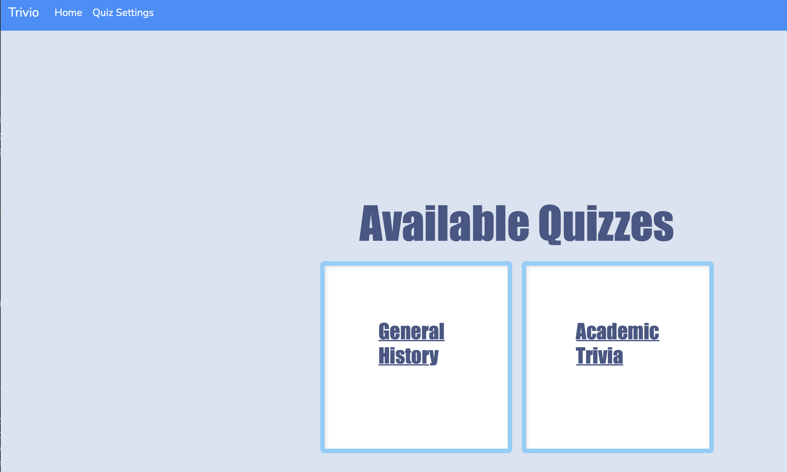
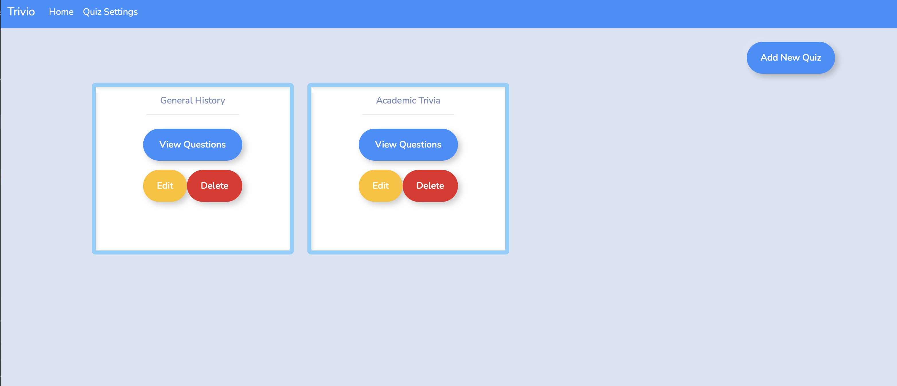
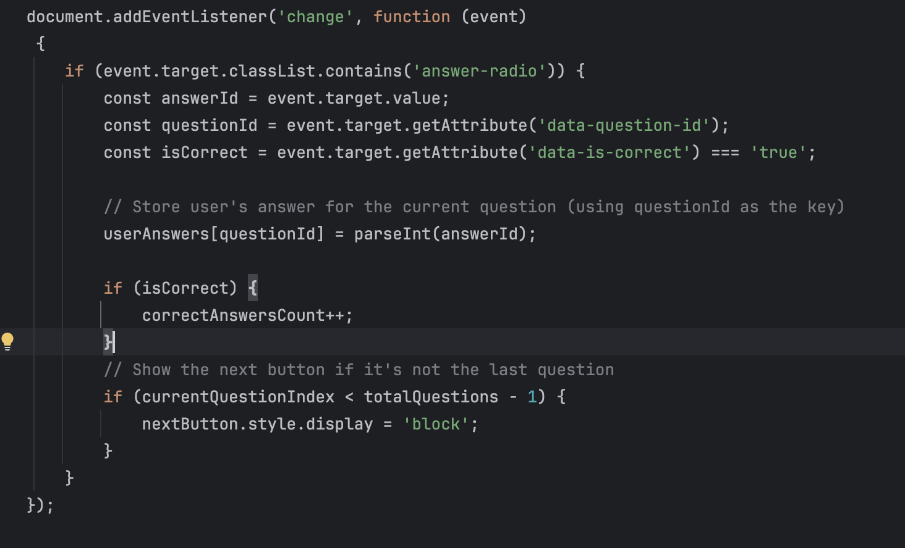

# Trivio Quizzlet App

## Table of Contents

- [Description](#description)
- [Features](#features)
- [Development Process](#development-process)
- [Diagram](#diagram)
- [Challenges](#challenges)
  - [Challenge 1](#challenge-1)
  - [Challenge 2](#challenge-2)
- [Code Block Highlight](#code-block-highlight)
- [Retrospective](#retrospective)

## Description

Welcome to **Trivio**, an interactive quiz application that allows users to engage with various trivia quizzes. This project provides features to take quizzes, manage quiz settings, and add, edit, or delete quizes as well as view questions.
This project is a result of a two-day pair programming collaboration between Dureti and Hannah. The goal was to create a dynamic quiz platform using Spring Boot, Thymeleaf, and JavaScript. The application features an intuitive interface where users can take quizzes, navigate through questions, and receive feedback upon completion. The back-end handles quiz management, answer tracking, and scoring to provide a seamless user experience.

  
## Features

### 1. Home Page (Quiz List)
The home page displays a list of available quizzes that users can take. Simply click on the quiz title to navigate to the quiz start page.

**How to use:**
- Click on a quiz name (e.g., *General History* or *Academic Trivia*) to begin the quiz.
- The home page lists all the available quizzes that the user can choose from.

### 2. Quiz Start Page
Once a user clicks on a quiz from the home page, they are taken to the quiz start page. Here, you can see the total number of questions for the selected quiz and begin the quiz by pressing the **Start Quiz** button.

**How to use:**
- Review the total number of questions before starting.
- Press the **Start Quiz** button to begin answering questions.

### 3. Quiz Settings Page
The **Quiz Settings** page allows you to manage quizzes by adding, editing, deleting, or viewing questions within each quiz. This page provides you with buttons to control the content of each quiz.

**How to use:**
- **Add**: Create new quiz questions.
- **Edit**: Modify existing quiz questions.
- **Delete**: Remove a quiz or specific quiz questions.
- **View Questions**: See the list of questions within a specific quiz.

## Instructions
1. From the **Home** page, click on any quiz name to start the quiz.
2. Use the **Start Quiz** button to begin answering questions.
3. Visit **Quiz Settings** to add, edit, delete, or view quiz questions.

By following these steps, you can take full control of your quizzes and test your knowledge in different trivia categories!

## Development Process

During our development of the quiz application, we used a Trello board to break down tasks and track progress efficiently. This allowed us to manage the project in small, manageable steps. We focused on meeting the core requirements, such as allowing users to take quizzes, answer questions one at a time, and view their final score. Users could also add, edit, and manage quizzes with validation

### Trivio Database Diagram

We started the project by making the DAOs, Models, and Controllers. Once we finished those we started working on getting the "Start Quiz"
button to work and take you to the first questions. We added a next button to move you to the next question throughout the quiz.
We added a submit button, and after you press that you can see your results! We also created a page where you can add a new QuizTitle. We used bootswatch to style the website. 
We would collaborate and talk through bugs in the code, and during the weekend we would plan times to meet and program together. We would talk over things we could work on individually
when we weren't programming together. When we met again we would explain the code,references that helped us, and our thought processes. This helped us to continue working together to accomplish adding new features. 

## Challenges

### Challenge 1

#### Hannah

**Problem**:  
- Connecting the buttons to link to the right pages. I had troubles with having the right pathing to get the page to display.

**Approach**:  
- I tried to change the pathing myself at first, but couldn't seem to get it right. I looked at past projects and demos, and did research on pathing.

**Final Solution**:  
- I realized the `@GetMapping` and the `href` linked to my button needed to match for the page to display correctly.  
- I also needed to return the correct HTML page in my controller functions.  
- The solution is demonstrated in my code block below, where I have the working solution for the edit button.

## Challenge 2

#### Dureti

- **Problem**:  
  The problem was ensuring that the user could see the correct answers immediately after submitting a quiz. We needed a way to retrieve and display these answers dynamically without having to refresh the page or load the entire page again.

- **Approach**:  
  I decided to create a dedicated backend logic that would handle fetching the correct answers for each quiz. Once the quiz was submitted, a request would be made to the backend to get the correct answers for the specific quiz. On the frontend, JavaScript was used to send this request, retrieve the answers, and then dynamically update the page with the results. This allowed for a smooth and interactive user experience.

- **Final Solution**:  
  The solution was a seamless integration between the backend and frontend. The backend retrieved the correct answers, while the frontend handled user interaction and updated the page with the results. This allowed users to immediately see their results and the correct answers without any page reloads, providing a better overall experience.

## Code Block Highlight

### Hannah

### Dureti 

I'm particularly proud of the code that handles the process of fetching and displaying the correct answers after the quiz is submitted. It represents a clean integration of backend and frontend technologies, ensuring a smooth user experience without needing to reload the page.

- **Why I'm Proud**:  
  This code efficiently solves the problem of dynamically loading correct answers, uses modern `fetch()` API in JavaScript for handling asynchronous requests, and leverages Spring's backend capabilities to retrieve and filter the correct answers from the database. The whole flow from quiz submission to displaying results is seamless and provides immediate feedback to the user.

This piece of code not only improves the user experience by reducing load times but also represents a clear division of responsibilities between the backend and frontend.

## Retrospective 

##### Hannah
**Lessons learned**:  
- I learned to break big tasks into smaller, manageable ones. I also realized the importance of checking my syntax frequently for errors, as I often encountered issues like misspellings or misplaced curly brackets.

**What would you do differently**:  
- I would spend less time stuck on a bug. In the future, when I'm stuck, I'll take a short break and then do more research to understand the problem better before attempting to fix it.

**What would you do the same**:  
- I enjoyed the structured approach we used during development. The Trello board was especially helpful for tracking our progress, allowing us to focus on one task at a time.

**Future improvements if more time was available**:  
- With more time, I would have added features like the ability to add questions/answers to quizzes, a popup to indicate correct/incorrect answers, and a "previous" button so users could change their answers.  
- I would also have liked to explore website design, possibly animating elements with JavaScript. Although Bootswatch was convenient, designing the site from scratch would have been fun.

##### Dureti 

## Lessons Learned from the Project

### What did I learn from the project?
I learned how to effectively integrate frontend and backend components to create a dynamic and responsive quiz application. The project helped me improve my understanding of handling user interactions asynchronously using JavaScript and how to structure backend logic to process user data. It also reinforced the importance of seamless user experience and clean code structure.

### What would I do differently?
If I were to approach this project again, I would focus more on scalability and modularity from the start. For example, I would create a more robust REST API structure instead of relying on traditional MVC. This would allow for more flexibility, especially if I later decide to implement a single-page application (SPA) framework like React or Vue.js.

### What would I do the same?
I would keep the approach of using modern JavaScript for handling asynchronous requests and the integration of backend services like the current implementation. The separation of concerns between the backend fetching logic and frontend user interaction worked well and ensured a smooth user experience.

### If I had more time, what else would I add to the project?
With more time, I would implement a full quiz management system. Here are the key features I would add:

- **Add, Edit, and Delete Questions and Answers**:  
  Allow users to manage quiz content by adding new questions, editing existing ones, and deleting questions or answers. This would provide flexibility for users to create their own quizzes or modify existing ones.

- **Detailed Question and Answer Management**:  
  From the quiz detail page, allow users to click on a question name to view its details, including all possible answers. Users could add new answers, edit existing ones, and delete incorrect answers. A critical feature would be ensuring that only one answer per question is marked as correct.

- **Navigation Enhancements**:  
  I would add a "Previous" button to navigate back to earlier questions and a "Skip" option to allow users to revisit questions later. This would give users more control over their quiz-taking experience.

- **Show Results with Correct Answers**:  
  After users finish taking the quiz, I would show all the questions along with the correct answers and the user’s answers, allowing them to review their performance in detail.
  
**Interactive Feedback After Each Question**:  
  Instead of only showing the results at the end of the quiz, I would add immediate feedback after each question (correct/incorrect answer, explanation, etc.) to make the learning process more engaging.

By implementing these features, the quiz application would not only offer a more robust and flexible experience for users but also allow for better management of quiz content.

